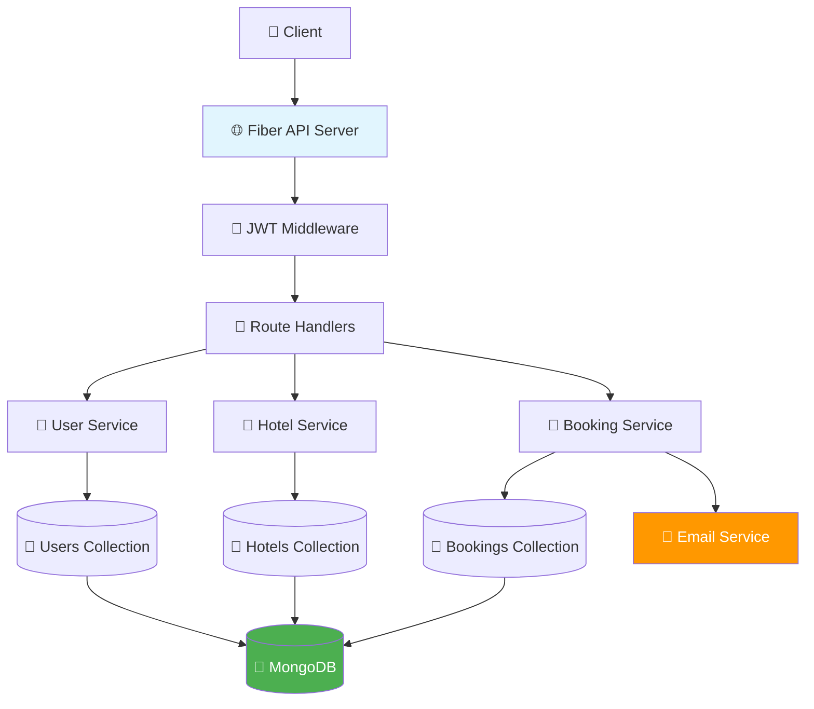
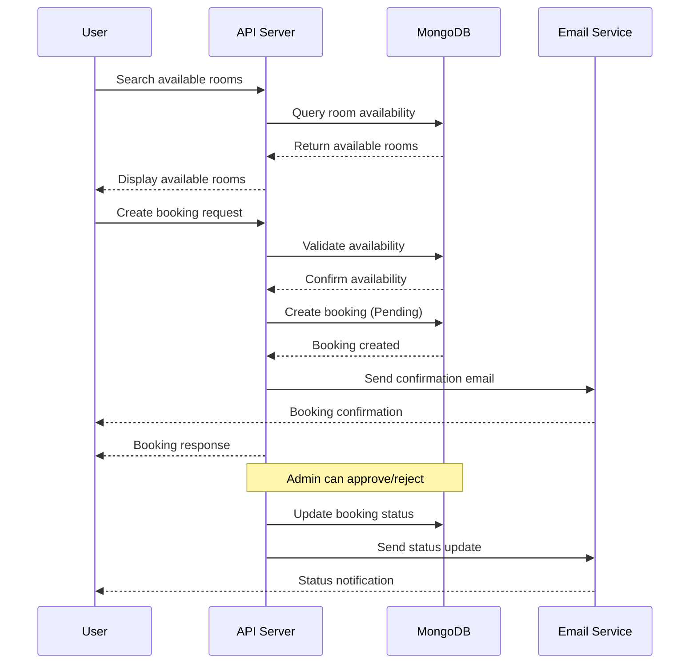
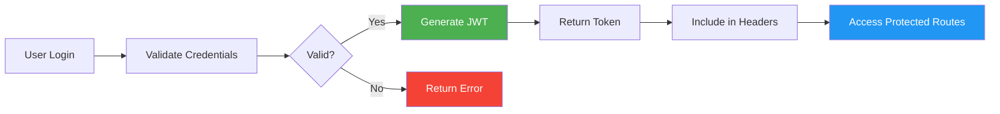

# 🏨 Hotel Reservation System

<div align="center">


*A modern, scalable hotel reservation system built with Go, Fiber, and MongoDB*

[📚 Documentation](#documentation) • [🚀 Quick Start](#quick-start) • [📋 API Reference](#api-reference) • [🛠 Development](#development)

</div>

---

## ✨ Features

<table>
<tr>
<td width="50%">

### 🔐 **Authentication & Security**
- JWT-based authentication
- Role-based access control
- Rate limiting protection
- CORS security headers
- Request validation & sanitization

### 🏨 **Hotel Management**
- Complete CRUD operations
- Room inventory management
- Real-time availability tracking
- Multi-location support

</td>
<td width="50%">

### 📅 **Smart Booking System**
- Intelligent availability checking
- Automated email notifications
- Booking status management
- Conflict resolution

### 👥 **User Experience**
- Intuitive registration flow
- Profile management
- Booking history tracking
- Admin dashboard capabilities

</td>
</tr>
</table>

---

## 🏗 Architecture Overview



---

## 🚀 Quick Start

### Prerequisites

- **Go** 1.19+ 
- **MongoDB** 4.4+
- **Git**

### Installation

```bash
# Clone the repository
git clone https://github.com/yourusername/hotel-reservation-system.git
cd hotel-reservation-system

# Install dependencies
go mod tidy

# Set up environment variables
cp .env.example .env
# Edit .env with your configuration

# Run the application
go run main.go
```

### 🐳 Docker Quick Start

```bash
# Using Docker Compose
docker-compose up -d

# The API will be available at http://localhost:8080
```

---

## 📁 Project Structure

```
hotel-reservation-system/
├── 📂 api/                 # HTTP request handlers
│   ├── auth_handler.go     # Authentication endpoints
│   ├── booking_handler.go  # Booking management
│   ├── hotel_handler.go    # Hotel operations
│   └── user_handler.go     # User management
├── 📂 cmd/                 # CLI applications
├── 📂 config/              # Configuration utilities
├── 📂 db/                  # Database layer
│   ├── models/             # Data models
│   └── stores/             # Database operations
├── 📂 middleware/          # HTTP middleware
│   ├── auth.go             # JWT authentication
│   ├── cors.go             # CORS handling
│   └── ratelimit.go        # Rate limiting
├── 📂 services/            # Business logic
├── 📂 tests/               # Test suites
├── 📂 types/               # Type definitions
├── 📂 util/                # Utility functions
└── 📄 main.go              # Application entry point
```

---

## 🛣 API Routes

### 🔓 Public Endpoints

| Method | Endpoint | Description |
|--------|----------|-------------|
| `POST` | `/api/auth` | User authentication |
| `POST` | `/api/register` | User registration |

### 🔒 Protected Endpoints

<details>
<summary><strong>🏨 Hotel Operations</strong></summary>

| Method | Endpoint | Description | Role |
|--------|----------|-------------|------|
| `GET` | `/api/v1/hotel` | List all hotels | User |
| `GET` | `/api/v1/hotel/:id` | Get hotel details | User |
| `POST` | `/api/v1/hotel` | Create hotel | Admin |
| `PUT` | `/api/v1/hotel/:id` | Update hotel | Admin |
| `DELETE` | `/api/v1/hotel/:id` | Delete hotel | Admin |

</details>

<details>
<summary><strong>🛏 Room Operations</strong></summary>

| Method | Endpoint | Description | Role |
|--------|----------|-------------|------|
| `GET` | `/api/v1/room` | List available rooms | User |
| `GET` | `/api/v1/room/:id` | Get room details | User |
| `POST` | `/api/v1/room` | Create room | Admin |
| `PUT` | `/api/v1/room/:id` | Update room | Admin |
| `DELETE` | `/api/v1/room/:id` | Delete room | Admin |

</details>

<details>
<summary><strong>📅 Booking Operations</strong></summary>

| Method | Endpoint | Description | Role |
|--------|----------|-------------|------|
| `GET` | `/api/v1/booking` | Get user bookings | User |
| `POST` | `/api/v1/booking` | Create booking | User |
| `GET` | `/api/v1/booking/:id` | Get booking details | User |
| `PUT` | `/api/v1/booking/:id` | Update booking | User |
| `DELETE` | `/api/v1/booking/:id` | Cancel booking | User |

</details>

### 👑 Admin Endpoints

| Method | Endpoint | Description |
|--------|----------|-------------|
| `GET` | `/api/v1/admin/users` | Manage all users |
| `GET` | `/api/v1/admin/bookings` | View all bookings |
| `GET` | `/api/v1/admin/hotels` | Manage all hotels |

---

## 🔄 Booking Flow



---

## 🛠 Development

### Running Tests

```bash
# Run all tests
go test ./...

# Run tests with coverage
go test -cover ./...

# Run specific test suite
go test ./tests/api_test.go
```

### Database Seeding

```bash
# Seed the database with sample data
go run cmd/seed/main.go
```

### Environment Variables

```env
# Server Configuration
PORT=8080
JWT_SECRET=your-super-secret-key

# Database Configuration
MONGO_URI=mongodb://localhost:27017/hotel_reservation
MONGO_DB_NAME=hotel_reservation

# Email Configuration
SMTP_HOST=smtp.gmail.com
SMTP_PORT=587
SMTP_USER=your-email@gmail.com
SMTP_PASS=your-app-password
```

---

## 🔐 Authentication Flow



---

## 📊 Data Models

### User Model
```go
type User struct {
    ID       primitive.ObjectID `bson:"_id" json:"id"`
    Email    string            `bson:"email" json:"email"`
    Password string            `bson:"password" json:"-"`
    Role     string            `bson:"role" json:"role"`
    Profile  UserProfile       `bson:"profile" json:"profile"`
}
```

### Hotel Model
```go
type Hotel struct {
    ID          primitive.ObjectID `bson:"_id" json:"id"`
    Name        string            `bson:"name" json:"name"`
    Location    string            `bson:"location" json:"location"`
    Rating      float64           `bson:"rating" json:"rating"`
    Rooms       []Room            `bson:"rooms" json:"rooms"`
    Amenities   []string          `bson:"amenities" json:"amenities"`
}
```

### Booking Model
```go
type Booking struct {
    ID          primitive.ObjectID `bson:"_id" json:"id"`
    UserID      primitive.ObjectID `bson:"user_id" json:"user_id"`
    HotelID     primitive.ObjectID `bson:"hotel_id" json:"hotel_id"`
    RoomID      primitive.ObjectID `bson:"room_id" json:"room_id"`
    CheckIn     time.Time         `bson:"check_in" json:"check_in"`
    CheckOut    time.Time         `bson:"check_out" json:"check_out"`
    Status      BookingStatus     `bson:"status" json:"status"`
    TotalAmount float64           `bson:"total_amount" json:"total_amount"`
}
```

---

## 🤝 Contributing

We welcome contributions! Please see our [Contributing Guide](CONTRIBUTING.md) for details.

### Development Workflow

1. **Fork** the repository
2. **Create** a feature branch (`git checkout -b feature/amazing-feature`)
3. **Commit** your changes (`git commit -m 'Add amazing feature'`)
4. **Push** to the branch (`git push origin feature/amazing-feature`)
5. **Open** a Pull Request

---

## 📝 License

This project is licensed under the MIT License - see the [LICENSE](LICENSE) file for details.

---

## 📞 Support

<div align="center">

**Need help?** 

[](https://github.com/yourusername/hotel-reservation-system/issues)
[](https://discord.gg/your-discord)
[](mailto:support@yourhotel.com)

</div>

---

<div align="center">

</div>
